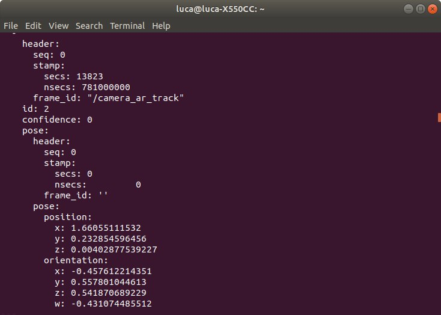
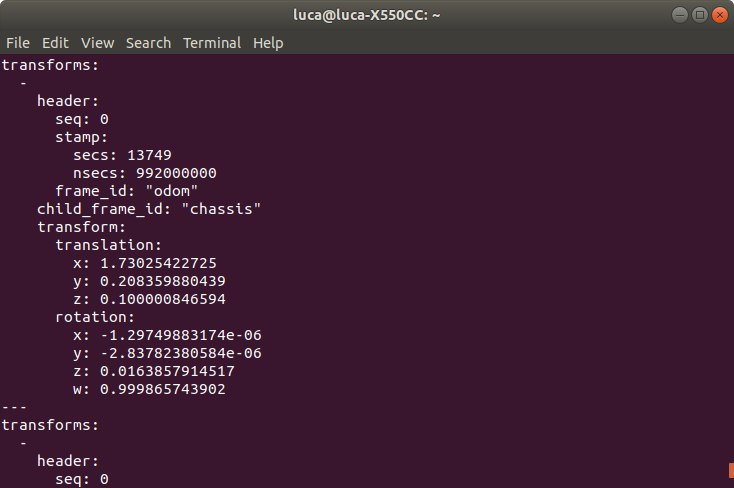

# ZEDbot Simulation
This folder is relative to the simulation stage developed for my master thesis work. The project is called *Autonomous charging system for a three wheels robot*. 

The main goal of this project has been to find a way to drive the robot from a position to the station.

In this subsection, as first I will explain the algorithm to drive the robot from a defined position to the station, whenever it needs to be recharged. Then I'll explain how I have implemented the robot on Gazebo and how I have translated the docking algorithm in C++ functions that communicate in ROS framework.

## Algorithm
After a reserch on the state-of-the-art of this technology with a comparison among the different sensor systems (e.g. infrared sensors, Lidar, GPS, RFID), I decided to take advantage of a **vision sistem** to detect an AR tag, placed on the station. 
For the development of the algorithm, I decided to divide the algorithm in 2 phases:

- **First Phase**: Approach to the perpendicular line to the tag.
- **Second Phase**: Straight approach to the tag in a safe and precise manner.

During the the docking operation, the robot should keep contact with the station, so the camera has to not lose the contact with the tag. One of the most important feature is the maximum orientation (Phi) the robot not lose the tag. In the first phase, the algorithm should make the robot rotate to reach the maximum orientation  (sigma -> Phi) in order to approach the perpendicular line as soon as possible and to complete the first phase. In this way, the robot can have enough space the complete the second phase. In the second phase the robot should reduce its speed until it stops in correspondence of the tag. ..
First Phase             |  Second Phase
:-------------------------:|:-------------------------:
  |  

The algorithm provides speeds until the distance is higher than the minimum distance (i.e. when the robot is approached with the station). 

Then, in the first phase the algorithm checks:
- the **orientation sigma** to be as close as possible to the maximum orientation **Phi**
- the **angle** to understand from which part the the robot is approaching (from the left or from the right).

While in the second phase, the robot has to check the orientation to be as small as possible and to rotate clockwise or counterclockwise so that the robot recovers the right direction and straightly reaches the station. 

Moreover, the *speed* varies with the distance. The higher the distance, the higher will be the speed, kind of an Hook's law. Thanks to this trick the robot can approach to the station in a safe manner. 

The flow chart of the algorithm:

## Robot in Gazebo
The first step has been to implement the robot body with simple shapes (e.g. rectangulars, cylinders, spheres) in [mybot.xacro](https://github.com/LucaRoma97/mybot/blob/b5fe0e65ebe47e8366c96522a384b29c5b41f82d/src/my_bot_description/urdf/mybot.xacro). Then I added the camera functionality to sense the Gazebo environment and the differential drive one in order to separetely drive the two wheels. At the end, I built the environment recreating the Los Angeles apartment on Gazebo. 

## Docking operation
ROS framework has been used as the development system for this project. It allows the nodes (i.e. C++ functions) to publish messages into topic to the ROS Master. These messages can be subscribed from other functions providing a communication system between them. 

The main functions developed for this algorithm are:
- [**ar_track_alvar**](https://github.com/LucaRoma97/ZEDbot/blob/master/README.md#ar_track_alvar): Detect the tag and publish the translation and rotation between camera and tag.
- [**DistanceAngle**](https://github.com/LucaRoma97/ZEDbot/blob/master/README.md#distanceangle): Subscribe translation and rotation and provide distance, angle and orientation.
- [**Docking**](https://github.com/LucaRoma97/ZEDbot/blob/master/README.md#docking): Provide the left and right speeds to the wheels based on the distance, angle and orientation.

### ar_track_alvar
[*ar_track_alvar*](http://wiki.ros.org/ar_track_alvar) is the state-of-the-art in ROS for detecting this kind of tags. It publishes the rotation and translation information between camera and tag on the form of "[*tf2_msgs*](http://docs.ros.org/en/jade/api/tf2_msgs/html/msg/TFMessage.html)" message on the "*tf*" topic.

  

### DistanceAngle
This rotation and translation information between camera and tag are subscribed and manipulated by the [**distanceangle**](https://github.com/LucaRoma97/distanceangle/blob/2b8b2acca71045aa31f86ee3143f056a31fe56de/src/distance_angle.cpp) node in order to extract the information about the *distance, angle* and *orientation*, that are required for the algorithm. Then they are published as a custom message [*DistanceAngle.msg*](https://github.com/LucaRoma97/distanceangle/tree/2b8b2acca71045aa31f86ee3143f056a31fe56de/msg).

Moreover, this function also subscribes "*tf*" that keeps track of the robot movement (odometry) with respect a fixed map reference frame (*odom*). Since the *tf* rotation information are published as quaternions, one main step is to transform them in RPY angles.

The corresponding callback functions for the subscriptions look for two tf messages:
- *odom / chassis*: to update the odometry between the robot and the fixed map reference frame.
- *ar_marker_n / camera_optical_frame*: geometric information between camera and tag, useful for the algorithm.

At the end, it publishes on "*DistanceAngle*" the distance, angle and orientation and the Yaw angle on "*odomangle*".
Both pubblications are subscribed by [*dockingrobot*](https://github.com/LucaRoma97/dockingrobot/tree/a28d013236bdf047667e3db3c0b97a9e773126d9). The latter is just a *float* variable, while the former is represented below:

For this functions, a class called **MarkerParameters** has been built. It incorporates the RPY angles and the algorithm parameters (distance, angle and orientation) as variables and *four public functions*. 

The first function converts the *tf* quaternions in RPY angles of the *odom / chassis* message, while the other three are used to tackle *ar_marker_n / camera_optical_frame* message. These latters convert the rotation quaternions in RPY, computes distance and angle from the translation information and publish them.

### DockingRobot
At the end, the [**dockingrobot**](https://github.com/LucaRoma97/dockingrobot/blob/a28d013236bdf047667e3db3c0b97a9e773126d9/src/docking.cpp) function subscribes them and, based on the data, computes the **maximum orientation** and sends the **speed signals** to the differential drive functionality of the robot and so to the Gazebo simulation. 

This function is made of for loop and if statements. The if statements compare the **robot orientation and the maximum orientation** and check the **sign of the angle**. The speed signals are sent according to these checks in order to be compatible with the docking algorithm, so the **flow chart**.

For instance, if the robot is on the **right hand** during the first phase of the docking operation and its orientation is lower than the maximum orientation Phi, the algorithm communicates to the robot to **rotate** counterclockwise to **recover the gap** and vice versa.  

As long as the robot is in the first phase it can only rotate either clockwise or counterclockwise (2 if statements). 

Whenever it reaches the second phase it has to rotate only to adjust the orientation since the angle is inside the tolerance.

Here I have a short video of the [Simulation](https://www.youtube.com/watch?v=KLvEFriNRXY) on my Youtube channel.

The next step regards the design, building and integration of a [custom robot](https://github.com/LucaRoma97/ZEDbot-robot-integration). 
